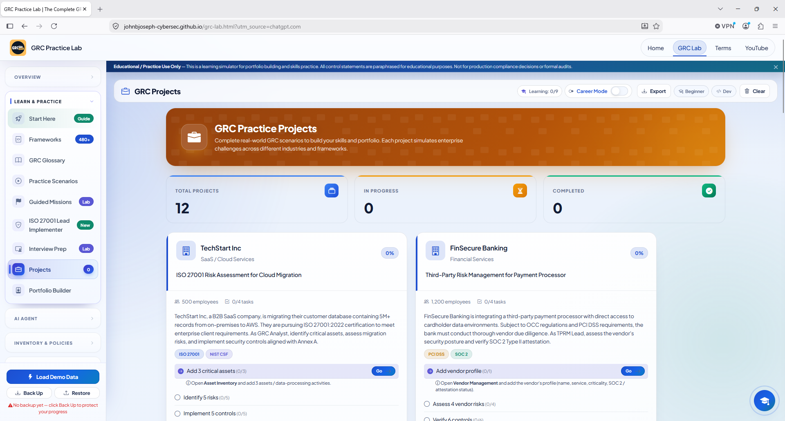
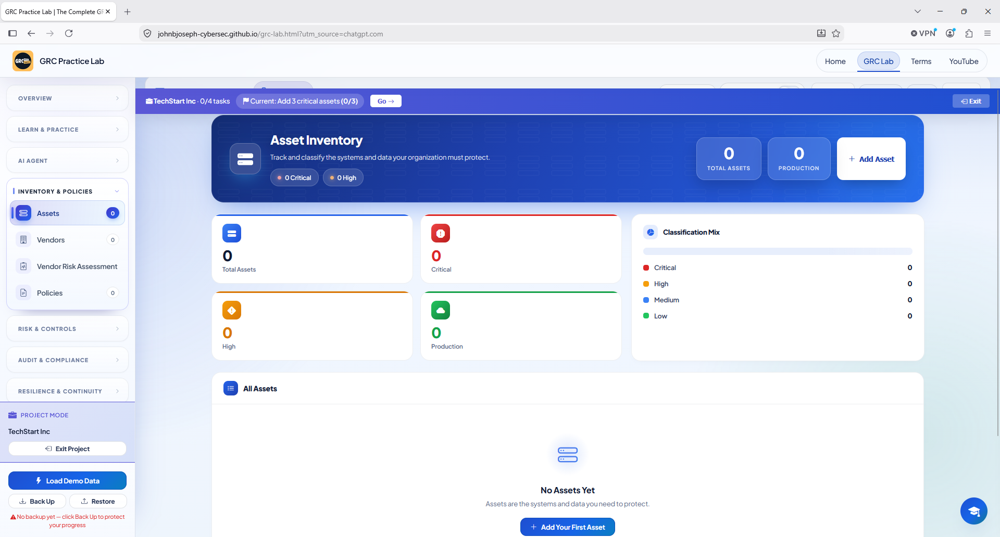
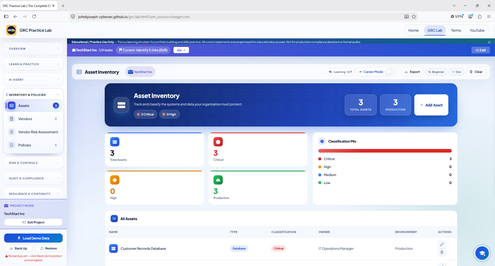
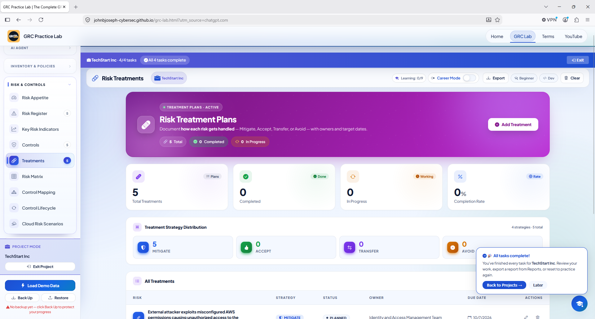
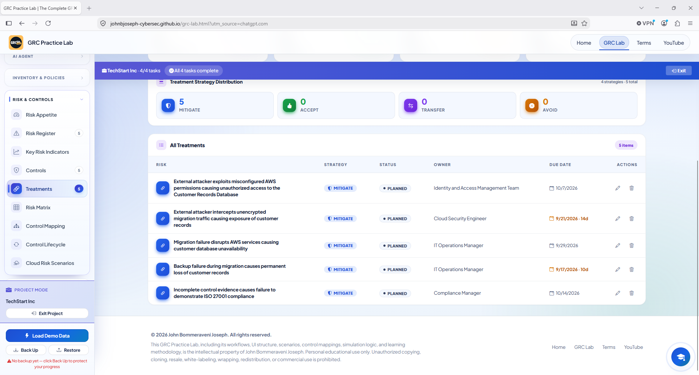
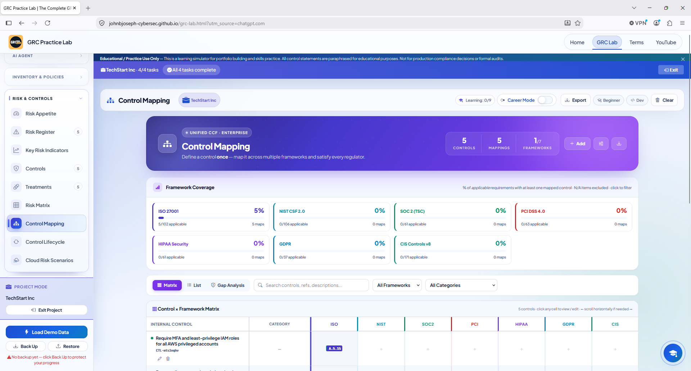
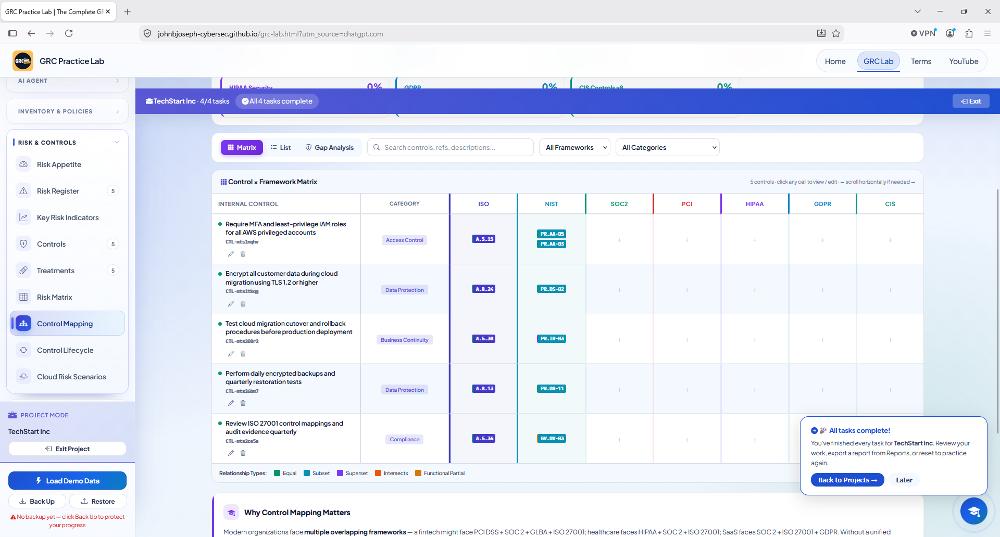

# Darwin GRC ISO 27001 Cloud Migration Risk Assessment

## Project Overview

This educational GRC project documents a simulated ISO 27001 risk assessment for TechStart Inc., a fictional organization migrating its customer-record systems to Amazon Web Services (AWS).

The project demonstrates how a GRC analyst identifies critical assets, evaluates cloud risks, designs security controls, creates risk-treatment plans, and maps controls between ISO 27001 and the NIST Cybersecurity Framework (CSF) 2.0.

> **Disclaimer:** This project was completed in the GRC Practice Lab for educational and portfolio purposes. It does not represent a production audit, certification opinion, or formal compliance determination.

---

## Project Objectives

- Identify critical assets included in the AWS cloud migration.
- Document security, availability, and compliance risks.
- Calculate inherent risk using likelihood and impact.
- Design specific, measurable, and testable controls.
- Map controls to ISO 27001 and NIST CSF 2.0.
- Create risk-treatment plans with owners and target dates.
- Identify evidence for validating control effectiveness.

---

## Frameworks

- ISO/IEC 27001
- NIST Cybersecurity Framework 2.0

---

## Project Scope

The assessment covered three critical production assets:

| Asset | Type | Owner | Criticality |
|---|---|---|---|
| Customer Records Database | Database | IT Operations Manager | Critical |
| AWS Production Environment | Application | Cloud Security Engineer | Critical |
| Identity and Access Management System | Application | Information Security Manager | Critical |

---

## Risk-Assessment Method

Risks were scored using a 5 × 5 matrix:

**Risk score = Likelihood × Impact**

| Score | Risk level |
|---:|---|
| 16–25 | Critical |
| 11–15 | High |
| 6–10 | Medium |
| 1–5 | Low |

---

## Risk Register

| ID | Risk | Category | Likelihood | Impact | Score | Rating | Owner |
|---|---|---|---:|---:|---:|---|---|
| R-01 | External attacker exploits misconfigured AWS permissions, causing unauthorized access to the Customer Records Database | Access Control | 4 | 5 | 20 | Critical | Information Security Manager |
| R-02 | External attacker intercepts unencrypted migration traffic, causing exposure of customer records | Data Protection | 3 | 5 | 15 | High | Cloud Security Engineer |
| R-03 | Migration failure disrupts AWS services, causing customer-database unavailability | Availability | 3 | 4 | 12 | High | IT Operations Manager |
| R-04 | Backup failure during migration causes permanent loss of customer records | Data Protection | 2 | 5 | 10 | Medium | IT Operations Manager |
| R-05 | Incomplete control evidence causes failure to demonstrate ISO 27001 compliance | Compliance | 3 | 4 | 12 | High | Compliance Manager |

### Key Risk Finding

The highest-rated risk was unauthorized access caused by misconfigured AWS permissions. It received a score of **20 (Critical)** because privileged-account compromise could expose sensitive customer information and significantly affect the organization.

---

## Security Controls

Five security controls were designed to address the identified risks:

| ID | Control | ISO 27001 | NIST CSF 2.0 | Category | Frequency | Owner |
|---|---|---|---|---|---|---|
| C-01 | Require MFA and least-privilege IAM roles for all AWS privileged accounts | A.5.15 | PR.AA-05 and PR.AA-03 | Access Control | Continuous | Identity and Access Management Team |
| C-02 | Encrypt all customer data during cloud migration using TLS 1.2 or higher | A.8.24 | PR.DS-02 | Data Protection | Continuous | Cloud Security Engineer |
| C-03 | Test cloud-migration cutover and rollback procedures before production deployment | A.5.30 | PR.IR-03 | Business Continuity | Quarterly | IT Operations Manager |
| C-04 | Perform daily encrypted backups and quarterly restoration tests | A.8.13 | PR.DS-11 | Data Protection | Continuous | IT Operations Manager |
| C-05 | Review ISO 27001 control mappings and audit evidence quarterly | A.5.36 | GV.OV-03 | Compliance | Quarterly | Compliance Manager |

---

## Control Validation

The controls were designed with the following validation activities:

- Review privileged AWS accounts and MFA-enrollment records.
- Examine IAM policies for excessive or unauthorized permissions.
- Confirm that migration connections require TLS 1.2 or higher.
- Test whether plaintext connections are rejected.
- Review cloud-migration cutover and rollback test results.
- Examine backup-success logs and restoration-test records.
- Review updated control mappings and audit-evidence checklists.
- Track missing evidence and corrective actions through closure.

---

## Risk-Treatment Plan

All five risks were assigned the **Mitigate** strategy.

| Risk | Planned response | Owner | Target date |
|---|---|---|---|
| R-01 | Enforce MFA, replace excessive permissions with role-based least privilege, remove unused credentials, and require approval for privileged roles | Identity and Access Management Team | October 7, 2026 |
| R-02 | Enforce TLS 1.2 or higher, block insecure transfer protocols, validate certificates, and monitor migration connections | Cloud Security Engineer | September 21, 2026 |
| R-03 | Test cutover, service recovery, and rollback procedures before production deployment | IT Operations Manager | September 29, 2026 |
| R-04 | Create daily encrypted backups in a separate AWS location and perform quarterly restoration tests | IT Operations Manager | September 17, 2026 |
| R-05 | Review control mappings and evidence quarterly and track missing or outdated documentation | Compliance Manager | October 14, 2026 |

All treatment plans were recorded as **Planned**. Residual risk should be reassessed after the controls have been implemented and supported by testing evidence.

---

# Project Screenshots

## 1. TechStart Project Overview

This dashboard shows the TechStart Inc. project and its assigned GRC tasks.



---

## 2. Initial Asset Inventory

This screenshot shows the empty asset inventory before the project assets were documented.



---

## 3. Critical Asset Inventory

Three critical assets were added to define the assessment scope.



---

## 4. Completed Risk-Treatment Dashboard

The dashboard confirms that five treatment plans were created and all assigned project tasks were completed.



---

## 5. Detailed Risk-Treatment Plans

This view presents the risks, mitigation strategies, treatment statuses, responsible owners, and target dates.



---

## 6. ISO 27001 Control Mapping

The control-mapping matrix connects the internal controls to their ISO 27001 references.



---

## 7. ISO 27001 and NIST CSF Crosswalk

The completed crosswalk demonstrates how the same internal controls align with ISO 27001 and NIST CSF 2.0 outcomes.



---

## Evidence Examples

Evidence that could support these controls includes:

- MFA-enrollment reports
- AWS IAM policy reports
- Privileged-access review approvals
- TLS configuration records
- Certificate-validation results
- Migration connection logs
- Cutover and rollback test reports
- Backup-success logs
- Restoration-test results
- Control-mapping review checklists
- Evidence-remediation trackers

---

## Skills Demonstrated

- GRC risk assessment
- Risk-register development
- Likelihood and impact scoring
- ISO 27001 control mapping
- NIST CSF 2.0 cross-mapping
- AWS cloud-risk analysis
- Identity and access management
- Least-privilege access
- Encryption and data protection
- Business-continuity planning
- Backup and recovery testing
- Risk-treatment planning
- Compliance evidence management
- Control-testing documentation

---

## Repository Structure

```text
ISO27001-Cloud-Risk-Assessment/
├── README.md
├── data/
│   └── grc-export-2026-09-08.json
├── docs/
│   ├── ASSESSMENT-SUMMARY.md
│   ├── CONTROL-CROSSWALK.md
│   └── RISK-TREATMENT-PLAN.md
└── screenshots/
    ├── 01-Techstart-Project-Overview.png
    ├── 02-Asset-Inventory-Empty.png
    ├── 03-Critical-Asset-Inventory.png
    ├── 04-Completed-Risk-Treatment-Dashboard.png
    ├── 05-Detailed-Risk-Treatment-Plans.png
    ├── 06-ISO27001-Control-Mapping.png
    └── 07-ISO27001-NIST-Control-Crosswalk.png
```

---

## Data Export Note

The original JSON file downloaded from the simulator is preserved in the `data` folder. The file contains the expected GRC schema, but its project-data arrays are empty. The populated project results are supported by the screenshots included in this repository.

---

## Author

**Darwin Brown Jr.**

GRC and Cybersecurity Portfolio  
[GitHub Profile](https://github.com/browndarwin231-Tech)
